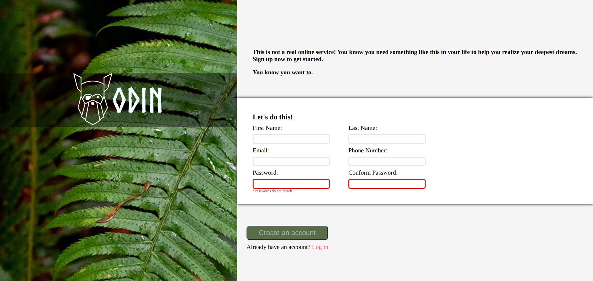

# Sign-Up-Form

This project is a **Mobile first** sign-up form for an imaginary service.

**Why I did this project?**

I did this project, while I am learning javascript-full-stack web, as a final project inorder to demonstrate the skills I learned about **Forms** from the **The Odin's Project(TOP)** :-Intermediate HTML and CSS part.

**How the project has done?**

The design for this project was given with some requirements and flexiblity to use my own styling and creativity.

# Live demo

